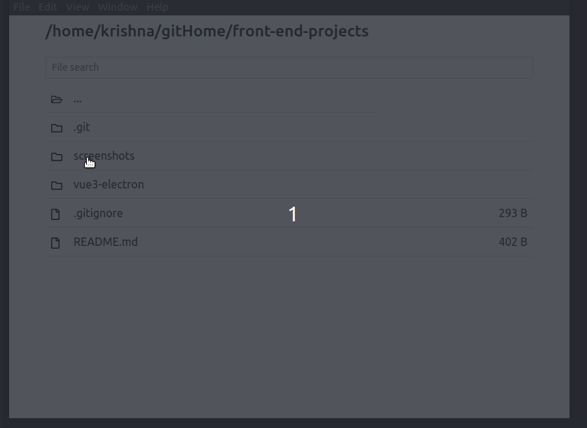

# Mix of front-end projects

## vue3-electron

This is the simple project based on [Youtube tutorial](https://www.youtube.com/watch?v=LnRCX074VfA) on building desktop app using Vue and Electron. 

It will build a simple file explorer in any OS platform that allows the user to view the file with sizes and navigate inside the directories and also allows the user for a simple file search operations.

